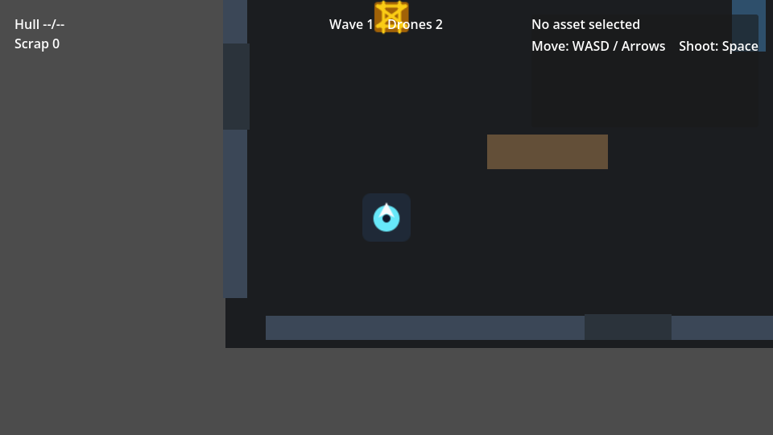
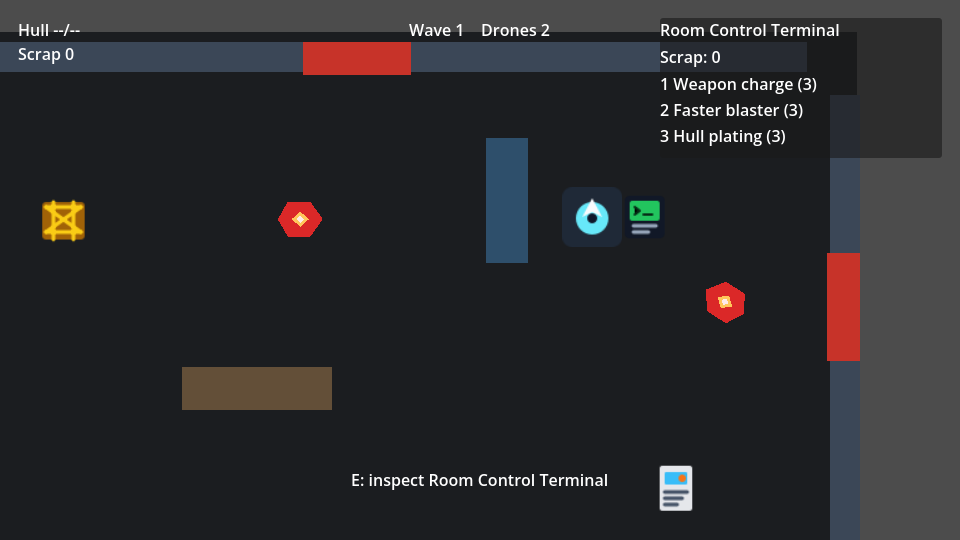
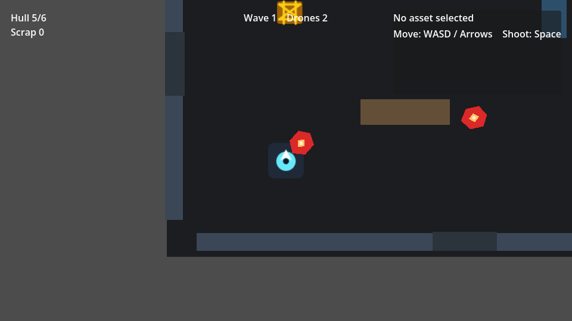

# Workshop Holdout

Workshop Holdout is a compact Godot 4 single-room survival prototype. The player is trapped in a workshop during a drone breach, clearing waves of enemies while using a room terminal to buy small upgrades with scrap.

The scope is intentionally modest. I kept the game loop small so the Godot workflow stays visible: scenes, signals, input actions, collision, HUD updates, enemy behavior, and a little progression.

## Screenshots







## Current Build

- Single-room arena with blocked movement areas and inspectable props.
- Enemy waves that spawn from workshop doors.
- Door warning flashes before enemies enter.
- Basic blaster shooting with muzzle flash.
- Enemy hit feedback and small death effects.
- Player hull health, damage cooldown, and game-over restart.
- Scrap rewards after cleared waves.
- Upgrade terminal for weapon damage, fire rate, and hull plating.
- HUD for wave count, drone count, hull, scrap, prompts, status messages, and item details.
- Heavier drones begin appearing from wave 3.

## Controls

| Action | Input |
| --- | --- |
| Move | `WASD` or arrow keys |
| Shoot | `Space` |
| Inspect / use focused object | `E` |
| Upgrade weapon damage | `1` at the terminal |
| Upgrade fire rate | `2` at the terminal |
| Upgrade hull | `3` at the terminal |
| Restart after game over | `R` |

## Upgrade Terminal

The room control terminal opens the upgrade menu when inspected with `E`.

Available upgrades:

- Weapon charge: increases blaster damage.
- Faster blaster: reduces shot cooldown.
- Hull plating: increases max hull and repairs one hull point.

Scrap is awarded after clearing each wave.

## Practiced Concepts

- Godot scene composition with instanced scenes.
- `CharacterBody2D` player and enemy movement.
- Input map actions for movement, shooting, interaction, upgrades, and restart.
- `Area2D` interaction detection.
- Exported GDScript properties for per-instance metadata.
- Signal wiring between the player, enemies, main scene, and HUD.
- Enemy wave spawning with door warning feedback.
- Player health, damage cooldowns, hit flash, and game-over state.
- Simple progression through terminal upgrades.
- `CanvasLayer` HUD updates.

## Project Structure

```text
assets/sprites/       Simple original SVG placeholders
docs/                 Devlog and next-step notes
scenes/               Godot scene files
scenes/ui/            HUD scene
scripts/              Focused GDScript files
```

## Requirements

- Godot 4.x

The project currently uses a Godot 4.6 project configuration.

## Run Locally

1. Clone the repo.
2. Open the project folder in Godot.
3. Run `scenes/main.tscn`.

## Manual Test Checklist

- Move around the workshop and confirm walls/cover block movement.
- Shoot drones and confirm hit/death feedback.
- Clear a wave and confirm the next wave starts.
- Watch door warning flashes before drones spawn.
- Reach wave 3 and confirm heavier drones can appear.
- Clear a wave, inspect the terminal, and buy an upgrade.
- Let hull reach zero and press `R` to restart.

## Status

This is a small portfolio/refresher project, not a full game. The current version focuses on a complete, playable loop with clear Godot systems rather than a large content scope.
